# Microsoft Defender for Office 365 Detections and Insights

## Overview

This template enables Defender for Office 365 reporting in Power BI for customers without Microsoft Sentinel, using the same visuals as the Sentinel workbook experience.

- What you get: MDO detections and insights visuals aligned with the Sentinel dashboard.
- Data scope: Up to 30 days, via Microsoft Graph Advanced Hunting.
- How it works: Power BI calls the Graph Security API (Advanced Hunting) using Web.Contents with application permissions. The app secret is stored and retrieved from Azure Key Vault via a custom connector.

If you need >30 days of data and have Sentinel, use the Sentinel workbook directly:
[Build custom email security reports and dashboards with workbooks in Microsoft Sentinel](https://techcommunity.microsoft.com/blog/microsoftdefenderforoffice365blog/part-2-build-custom-email-security-reports-and-dashboards-with-workbooks-in-micr/4411303)

Note: Power BI has no native Microsoft Graph connector; Web.Contents requires application permissions (delegated auth is not supported for this flow).

## 🔒 Security
*   **No Hardcoded Secrets**: Client Secrets stay in Key Vault.
*   **Least Privilege**: The Gateway only needs `Get` permission on the specific Secret, and `SecurityEvents.Read.All` on the Graph API.

## 🛠️ Components

### 1. KeyVaultConnector.mez (The Custom Connector)
A custom connector that facilitates secure communication with Azure Key Vault to retrieve the app secret.

### 2. Microsoft Defender for Office 365 Detection and Insights_v3.pbit (The Template Report)
The template report that uses the custom connector to retrieve the app secret and execute the KQL queries to retrieve the data necessary to build a MDO KPI dashboard.

## Before you begin (values you’ll need)

- Application (client) ID - (`GUID`)
- Directory (tenant) ID - (`GUID`)
- Azure Key Vault Url - (e.g. `https://myvault.vault.azure.net`)
- Key Vault secret name (that contains the app secret) - (e.g. `myappsecret`)

## 📦 Prerequisites

1) Register an app with application permission
- [Set up an application](https://learn.microsoft.com/en-us/entra/identity-platform/quickstart-register-app) and note Application ID and Directory (tenant) ID.  
  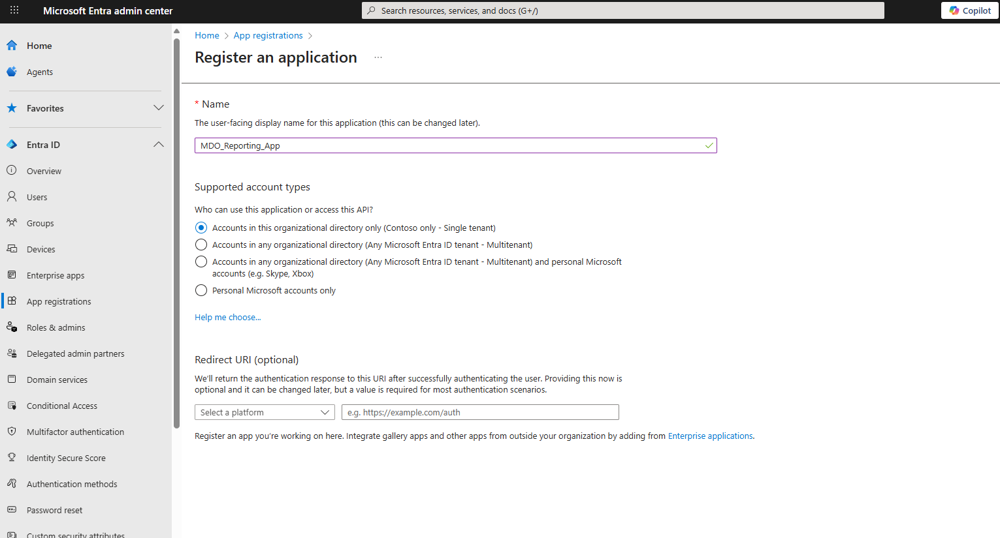
- Add Graph application permission ThreatHunting.Read.All and grant admin consent.  
  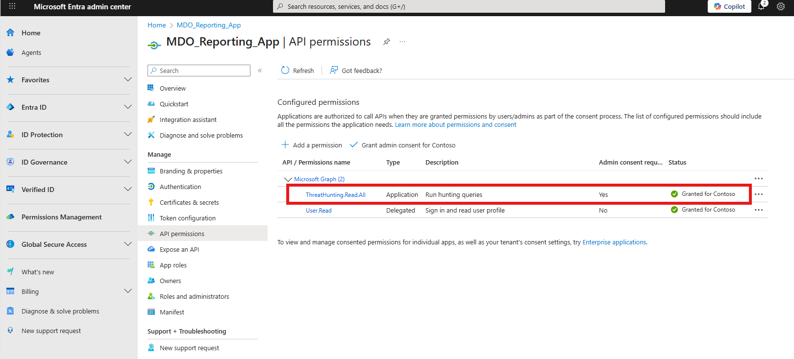
- Create a client secret (you’ll store this in Key Vault).  
  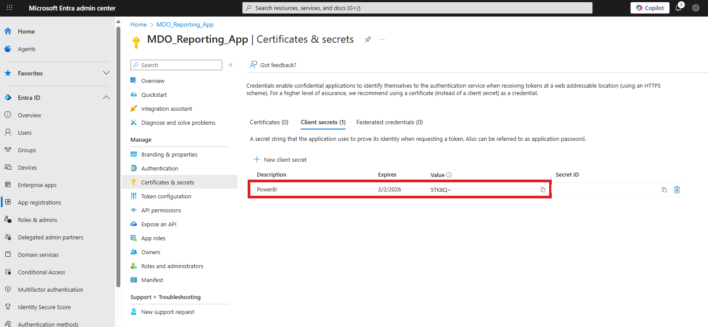

2) Prepare Azure Key Vault
- Create or use an existing Key Vault; note the Key Vault name. Click Import to add a secret.  
  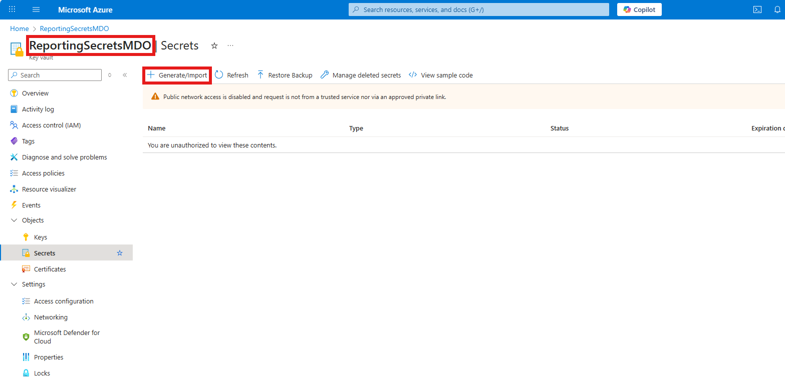
- Add a new secret: choose a secret name (record it) and paste the app secret value.  
  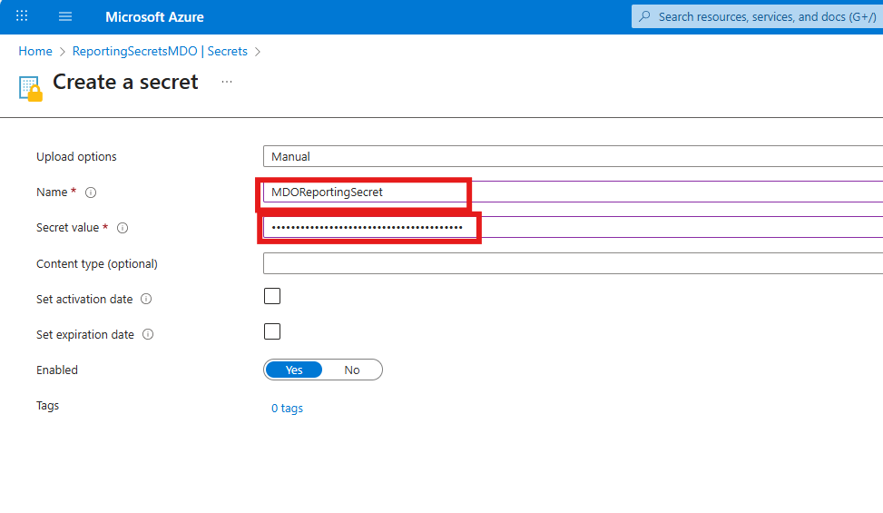
- Ensure Key Vault firewall/network settings allow your access to create/read the secret.  
  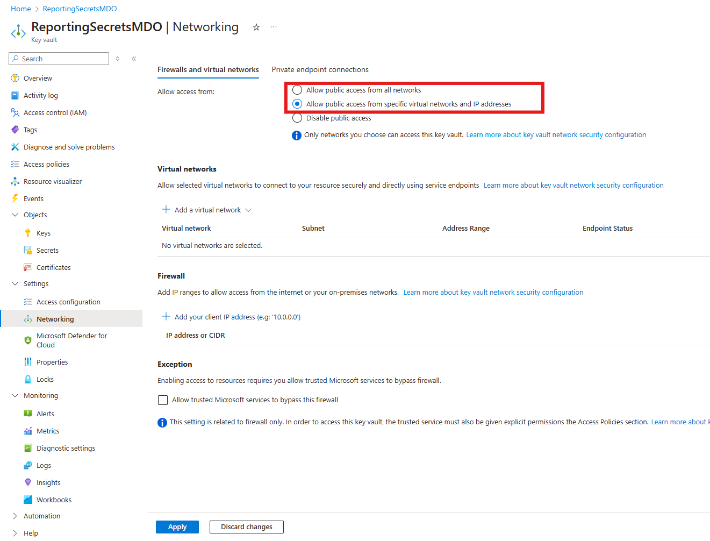

3) Grant access to the secret
- In the secret’s Access control, grant users who will open/refresh the report at least Key Vault Secrets User.  
  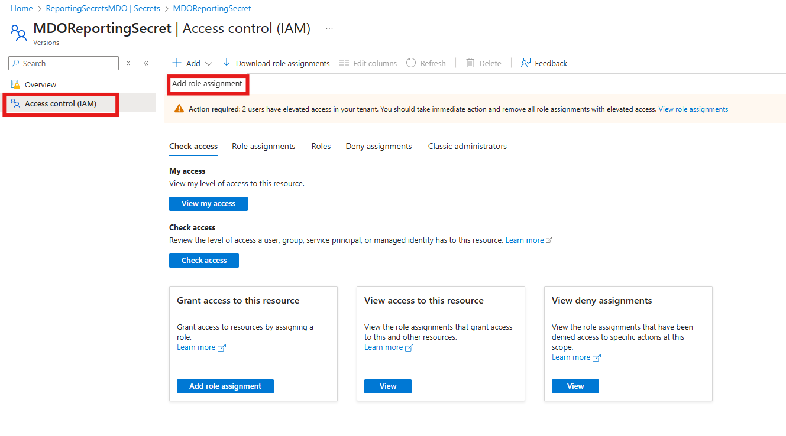  
  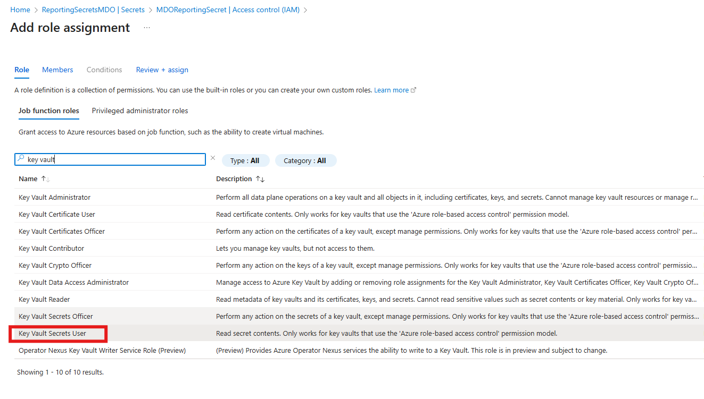

4) Enable custom connector support in Power BI Desktop
- Follow: [Connector extensibility in Power BI](https://learn.microsoft.com/en-us/power-bi/connect-data/desktop-connector-extensibility#custom-connectors) to deploy the connector:
    *   Copy `KeyVaultConnector.mez` to `Documents\Power BI Desktop\Custom Connectors`.
    *   Enable "Allow any extension..." in Power BI Options -> Security.
    
    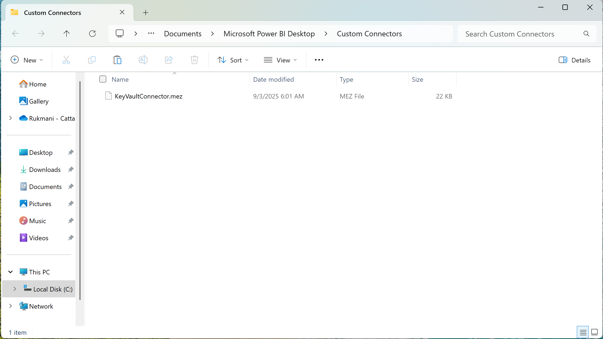

## 📊 Setup (Power BI Desktop)

1) Open the “Microsoft Defender for Office 365 Detections and Insights” template (.pbit).
2) Enter variables and Load:
   - Directory (tenant) ID
   - Application (client) ID
   - Key Vault name
   - Secret name (that holds the app secret)
   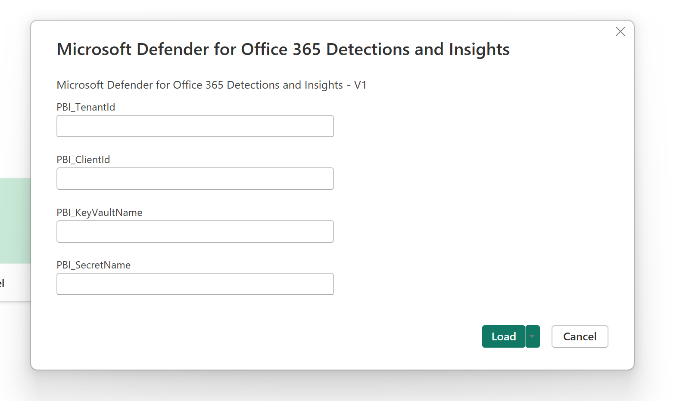
3) When prompted by the Azure Key Vault connector, sign in with a user that has access to the secret.  
   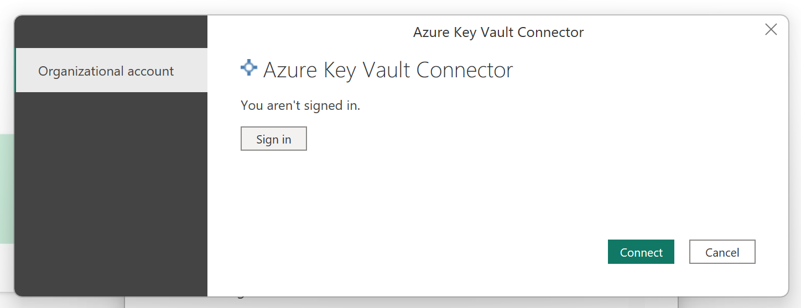
4) If a login.microsoftonline.com dialog appears, select “Anonymous” to proceed (required by the Web.Contents step).  
   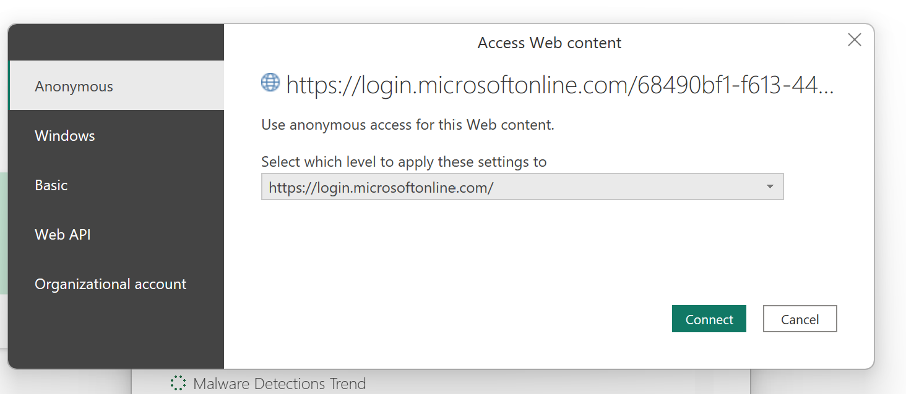
5) After loading completes, you’ll see the report:  
   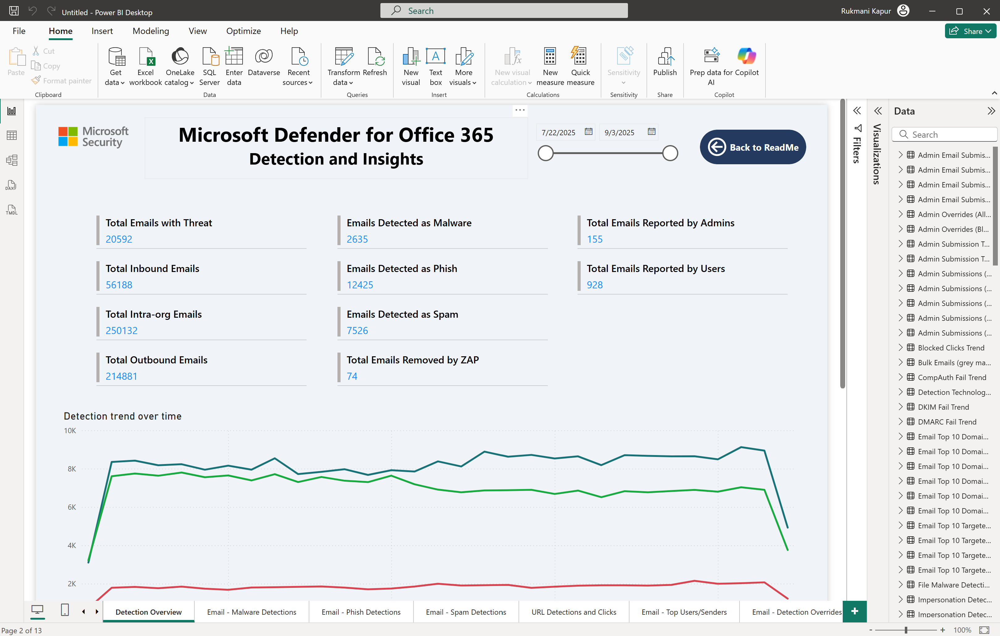

## Publish and scheduled refresh

You can publish the report to the Power BI Service to share it.

For scheduled refresh, a data gateway is required because the report uses a custom connector (for Key Vault). Configure the gateway and set refresh per:
[Data refresh in Power BI](https://learn.microsoft.com/en-us/power-bi/connect-data/refresh-data#connecting-to-on-premises-data-sources)

Context for this particular template here: [GatewayDeployment.md](GatewayDeployment.md)

## 🔧 Troubleshooting (quick checks)

- 403/401 on refresh: Confirm ThreatHunting.Read.All has admin consent and the app/secret are correct.
- Key Vault access denied: Verify firewall/network and that your user has Key Vault Secrets User.
- Connector not found: Re-check custom connector setup and security settings in Power BI Desktop.
- Extra auth prompt: Choosing Anonymous for login.microsoftonline.com is expected for Web.Contents.
